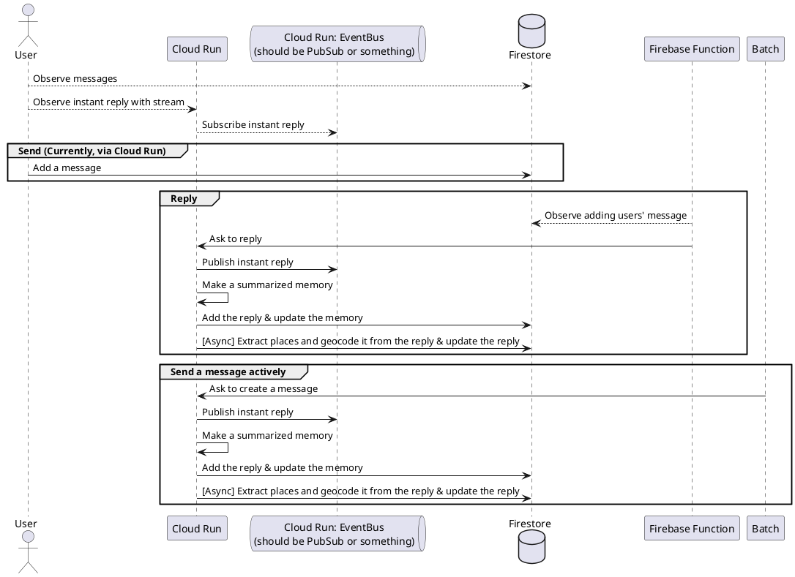
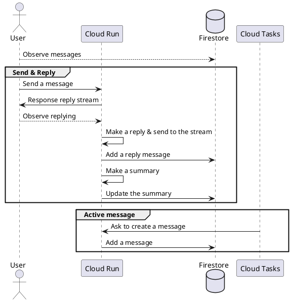
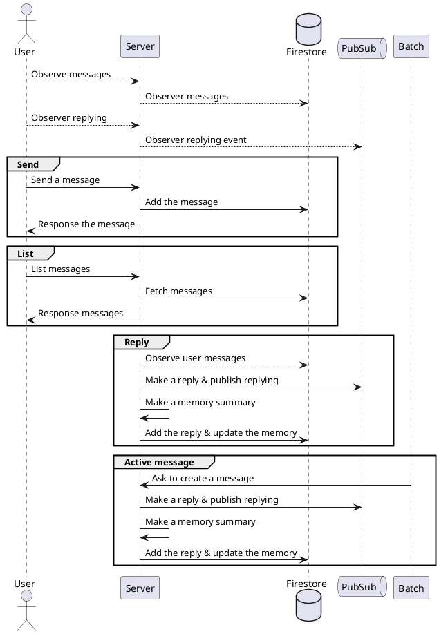

# Chat Flow

## Current

```plantuml
@startuml

actor  User as user
participant "Cloud Run" as cr
queue "Cloud Run: EventBus\n(should be PubSub or something)" as bus
database Firestore as fs
participant "Firebase Function" as ff
participant Batch as batch

user --> fs: Observe messages

user --> cr: Observe instant reply with stream
cr --> bus: Subscribe instant reply

group Send (Currently, via Cloud Run)
    user -> fs: Add a message
end

group Reply
    ff --> fs: Observe adding users' message
    ff -> cr: Ask to reply
    cr -> bus: Publish instant reply
    cr -> cr: Make a summarized memory
    cr -> fs: Add the reply & update the memory
    cr -> fs: [Async] Extract places and geocode it from the reply & update the reply
end


group Send a message actively
    batch -> cr: Ask to create a message
    cr -> bus: Publish instant reply
    cr -> cr: Make a summarized memory
    cr -> fs: Add the reply & update the memory
    cr -> fs: [Async] Extract places and geocode it from the reply & update the reply
end


@enduml
```

First

```plantuml
@startuml
actor  User as user
participant "Cloud Run" as cr
database Firestore as fs
participant "Cloud Tasks" as ct

user --> fs: Observe messages

group Send & Reply
    user -> cr: Send a message
    cr -> user: Response reply stream
    user --> cr: Observe replying
    cr -> cr: Make a reply & send to the stream
    cr -> fs: Add a reply message
    cr -> cr: Make a summary
    cr -> fs: Update the summary
end

group Active message
    ct -> cr: Ask to create a message
    cr -> fs: Add a message
end

@enduml
```

Ideal?

```plantuml
@startuml

actor  User as user
participant Server as server
database Firestore as fs
queue PubSub as ps
participant Batch as batch

user --> server: Observe messages
server --> fs: Observer messages

user --> server: Observer replying
server --> ps: Observer replying event


group Send
    user -> server: Send a message
    server -> fs: Add the message
    server -> user: Response the message
end

group List
    user -> server: List messages
    server -> fs: Fetch messages
    server -> user: Response messages
end

group Reply
    server --> fs: Observe user messages
    server -> ps: Make a reply & publish replying
    server -> server: Make a memory summary
    server -> fs: Add the reply & update the memory
end


group Active message
    batch -> server: Ask to create a message
    server -> ps: Make a reply & publish replying
    server -> server: Make a memory summary
    server -> fs: Add the reply & update the memory
end

@enduml
```

